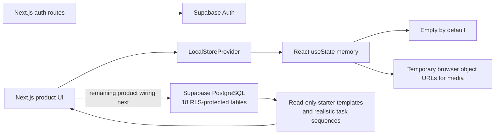
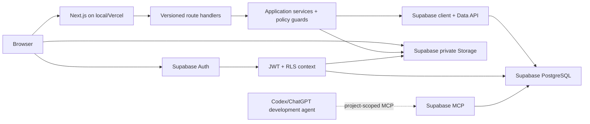

# Planisher - Current State and Hosted Development Roadmap

Status: Approved and in implementation
Last reviewed: 2026-07-15
Purpose: Keep one concise, current record of what Planisher is, what the repository actually does today, what is missing, and the next implementation sequence.

This document is the current execution guide. The larger [Product and Build Plan](./PRODUCT_AND_BUILD_PLAN.md) remains the detailed product specification and design history.

## 1. Main goal

Planisher is a construction planning SaaS for owner-builders, residential builders, contractors, and larger construction teams. It should become the shared source of truth for:

- projects and reusable project templates;
- construction schedules, dependencies, progress, and delayed work;
- task ownership, updates, problems, comments, and media;
- planned budgets, commitments, actual expenses, and variance;
- files, decisions, and a reliable audit trail;
- workspace members, project access, subscription limits, and usage.

The product should stay easy enough for one person building a house while retaining a tenant, role, and data model that can grow into a multi-project company product.

## 2. Current as-built state

### 2.1 Runtime architecture today

The repository now contains three deliberate presentation surfaces: a desktop planning
prototype, an installable mobile-first PWA field view, and a public marketing site.
Hosted identity and the starter-plan catalog use Supabase; user-created product records
still use the browser-local prototype store. The next backend slice replaces that
remaining store with server-controlled Supabase data access.



There are currently:

- no API route handlers for product data;
- no application-service or repository layer in the runtime;
- Drizzle schemas plus two reviewed migrations applied to the personal Supabase development project;
- working Supabase sign-up, sign-in, sign-out, callback, password-reset, and cookie-session handling;
- authenticated route protection for `/app`;
- mandatory first-login onboarding for profile, role, workspace type/name, estimated team size, timezone, and currency;
- no server-side authorization or tenant enforcement;
- no subscription or usage-limit enforcement;
- no durable object/file storage.

A full browser refresh clears user-created product data and returns to an empty
workspace. No fake projects, users, costs, activity, or media are created. Five
read-only starter plans (single-storey house, double-storey house, multi-storey
building, hospital, and school) are loaded from Supabase for authenticated users.
The only runtime identity is the authenticated Supabase user. Selected image, audio,
and video files are represented by temporary object URLs and are not uploaded anywhere.

### 2.2 Working prototype capabilities

| Area | Current behavior |
| --- | --- |
| Application shell | Desktop navigation, project/workspace menu, user menu, locale summary, global search, overflow-safe identity labels, light/dark/system themes, global navigation progress, and route loading skeletons |
| Dashboard | Live locale date/time, portfolio metrics, an accessible status donut, project cards, delayed-task links, recent activity, and budget summary |
| Projects | Create blank or template-based project with an optional temporary cover image, search, status filter, grid/list view, duplicate, save as template, and delete |
| Templates | Load five persistent, RLS-protected starter plans; create temporary workspace templates; reuse tasks/dependencies with shifted dates and reset progress |
| Schedule | DHTMLX Gantt rendering, hierarchy, subtask creation, milestones, dependencies, day/week/month scale, task search, delayed filter, progress drag, issue flag, and focused task highlight |
| Task drawer | Edit title, description, dates, assignee, and progress; create a subtask; add task-linked budget/expense; add comments or raised problems |
| Comments/media | Text comments and problems can select images, audio, or video for temporary local preview |
| Budget | Portfolio totals, project budget lines, commitments/actual expenses, task/category filters, and task-linked costs |
| Files | File selection and metadata display in local memory |
| Activity | Local mutation feed, activity detail drawer, and navigation to related project/task/comment/budget/file view |
| Locale | Browser locale, timezone, and currency detection with local overrides/fallbacks |
| Mobile PWA | Manifest, icon/maskable icon, install suggestion, app chrome, compact dashboard, active-project list, searchable/filterable task lists, hierarchy/dependency cues, full-screen field updates/activity, account/logout menu, phone-synchronized light/dark theme, and safe offline fallback |
| Passkeys | Supabase experimental registration and sign-in controls are implemented only for the installed mobile PWA; the project-level Passkeys/RP configuration must be enabled before use |
| Marketing | Public landing page with rotating residential, school, and high-rise Three.js builds plus CSS fallback; a pinned, scroll-controlled site/truck story; GSAP reveals; feature carousel; workflow outcomes; pricing; contact form; authenticated navigation; and footer |

### 2.3 Partial or prototype-only capabilities

- Project creation exists, but full edit, archive, and restore workflows are incomplete.
- Gantt progress editing works, but durable drag/resize, reorder/reparent, dependency mutation, conflict handling, and rollback do not exist.
- The task drawer is functional, but task deletion, multiple assignees, mentions, comment editing/deletion, and problem resolution are incomplete.
- File and comment-media selection stores metadata/object URLs only; there is no upload progress, signed download, validation service, or persistence.
- Project cover images are temporary object URLs for the same reason; durable covers should become private Storage attachments referenced by a project record.
- The PWA is installable and has an offline fallback, but offline project reads/edits and background synchronization are intentionally not implemented before persistence and conflict handling.
- Passkeys use Supabase's experimental API. They require a stable HTTPS relying-party domain and manual enablement in Authentication settings; changing the relying-party ID invalidates registered passkeys.
- Activity resembles an audit trail but is mutable client memory, has no immutable before/after record, and is not security-grade.
- Budget calculations work in the browser, but there are no atomic server transactions or authorization rules.
- Workspace member invitations and real multi-user project assignments are not wired yet.
- Some prototype source strings contain character-encoding artifacts and need a cleanup pass.
- Automated unit, integration, end-to-end, accessibility, tenant-isolation, and large-Gantt tests are still missing.

### 2.4 Starter-plan and theme decisions (2026-07-14)

- Residential sequences follow the [NAHB outline of major construction phases](https://www.nahb.org/-/media/NAHB/other/builder-books/basic-construction-management/MT-GeneralOutlineOfMajorConstructionPhases.pdf) and the staged design-to-use structure in the [RIBA Plan of Work 2020](https://www.architecture.com/-/media/GatherContent/Test-resources-page/Additional-Documents/BOOKLETPRINTRIBAPlanofWork2020Overviewpdf.pdf).
- Hospital tasks add clinical workflows, specialist MEP/communications, infection control, validation, training, and regulatory readiness based on the [WBDG hospital guidance](https://stg.wbdg.org/building-types/health-care-facilities/hospital) and whole-life [building commissioning process](https://stg.wbdg.org/building-commissioning).
- School tasks add stakeholder briefing, safe access, specialist learning spaces, indoor-environment verification, staff training, and post-occupancy readiness based on the [WBDG elementary school guidance](https://stg.wbdg.org/building-types/education-facilities/elementary-school) and the [US Department of Energy zero-energy schools guidance](https://www.energy.gov/cmei/buildings/zero-energy-schools-design-implementation-guidance).
- Template durations and dependencies are editable starter assumptions. They are not engineering advice and must be reviewed for local code, procurement, site conditions, inspections, and authority requirements.
- Light/dark/system theming uses the browser's `prefers-color-scheme` preference and an early `color-scheme` declaration to prevent a mismatched initial render, following [MDN color-scheme guidance](https://developer.mozilla.org/en-US/docs/Web/CSS/Reference/Properties/color-scheme).
- Long workspace/account labels are clipped safely and glide only while their parent control is hovered or keyboard-focused. Continuous marquee motion was rejected because moving content must be pausable and reduced-motion preferences must be respected; see [WCAG Pause, Stop, Hide](https://www.w3.org/WAI/WCAG21/Understanding/pause-stop-hide.html) and [W3C reduced-motion technique C39](https://www.w3.org/WAI/WCAG22/Techniques/css/C39).
- Dynamic workspace routes use the Next.js `loading.tsx` convention so a prefetched skeleton appears immediately while server-rendered content streams. Server-action buttons also expose their own pending label and spinner, while a thin global progress line covers links and programmatic navigation.
- The mobile field UX follows a list-first hierarchy: dashboard → project → task → focused update/activity. The desktop Gantt is hidden at phone widths rather than compressed into a low-usability timeline.
- The installed PWA always follows the phone's `prefers-color-scheme` value and updates when the phone theme changes. Desktop/browser mode retains explicit light, dark, and system choices.
- The PWA identity control is a proper account menu rather than a direct passkey-settings shortcut. It includes account/device settings and a server-backed sign-out action.
- Install promotion is dismissible, remembered for seven days, and only appears after Chromium reports installability; iOS receives explicit Add to Home Screen instructions. The service worker does not cache authenticated product data.
- Passkeys are WebAuthn credentials: device biometrics/PIN authorize a private key locally, and Planisher/Supabase receive a signed assertion rather than biometric data.
- The public hero is one viewport tall on desktop. Its construction scene cycles three building types, the following site scene pins while the truck advances with scroll, and returning authenticated visitors see Dashboard rather than redundant sign-in actions.

## 3. Newly promoted MVP requirements

The following items were deliberately deferred during the local UI prototype. They are now required for the hosted development milestone:

1. Sign-up, sign-in, sign-out, email verification, password reset, and protected application routes.
2. User profile, workspace creation, workspace members, invitations, deactivation, and project membership.
3. Server-enforced workspace and project roles.
4. Persistent PostgreSQL storage for every product record.
5. Private object storage for documents, images, audio, and video.
6. Plan catalog, test subscriptions, usage reporting, and server-enforced project/task/member/storage limits.
7. Versioned APIs/application services, validation, optimistic concurrency, and append-only audit events.

Real payment collection remains a later step. The first entitlement milestone uses seeded/test subscriptions so limits can be proven before Stripe is introduced.

## 4. Recommended online services

### 4.1 Recommendation: Supabase Free for hosted development

Use one personal Supabase development project for:

- managed PostgreSQL;
- Supabase Auth for email/password sessions and later OAuth;
- Supabase Storage for private project and comment attachments;
- Row Level Security as defense in depth for workspace/project isolation;
- the official Supabase MCP server so an approved AI coding agent can inspect the development schema, migrations, logs, and data.

Keep Drizzle ORM as the code-first schema and offline migration-generation layer.
Use the Supabase JavaScript client for Auth, application data, and Storage through
the Data API. The application therefore needs only the project URL and publishable
key; no PostgreSQL connection string is required for local or Vercel runtime.

Why this is the best first choice:

- it provides database, authentication, and file storage in one development account;
- it preserves the relational PostgreSQL model already designed for projects, dependencies, budgets, members, and audit events;
- official Next.js Auth and Drizzle/Supabase guidance exists;
- Storage uses PostgreSQL Row Level Security policies;
- its official MCP server can be project-scoped, with writes limited to reviewed development migrations.

### 4.2 Free-tier constraints as of 2026-07-14

| Supabase Free resource | Included/behavior | Planisher impact |
| --- | --- | --- |
| Active projects | 2 | Use one dedicated Planisher development project |
| Database | 500 MB quota | Sufficient for functional testing and seeded construction data |
| Authentication | 50,000 monthly active users | Far above development-test needs |
| File storage | 1 GB | Sufficient for images and short test clips, not real construction media volume |
| Maximum upload | 50 MB per file | Enforce this limit in the development UI/API; long videos will not fit |
| Egress | 5 GB uncached plus 5 GB cached | Suitable for controlled testing, not open-ended media delivery |
| Inactivity | Free projects pause after one week of inactivity | The project may need to resume after quiet development periods |
| Backups | No managed automatic backups on Free | Do not treat the free project as production or store irreplaceable data |

### 4.3 Media growth path

Start with Supabase Storage because it keeps authentication, metadata, policies, and files together. Keep a `FileStorage` interface so attachments can later move without changing task/comment features.

If 1 GB total storage or the 50 MB upload limit becomes restrictive during testing, use Cloudflare R2 as the next adapter. R2 Standard currently includes 10 GB-month of free storage, 1 million Class A operations, 10 million Class B operations, and free direct egress. It is a better long-term media candidate, but adds a second provider and separate access-policy implementation.

### 4.4 Optional frontend hosting

Use Vercel Hobby for personal, non-commercial preview/testing deployments of this Next.js repository. It provides Git-based deployments and automatic HTTPS, but its Hobby terms are for personal/non-commercial use. Move to a commercial plan or another production host before Planisher becomes a paid SaaS.

The database and files remain in Supabase; Vercel only runs and serves the Next.js application.

### 4.5 Alternatives considered

| Option | Strength | Reason not selected first |
| --- | --- | --- |
| Neon Free + Cloudflare R2 | Strong serverless PostgreSQL, generous project count, larger free object-storage allowance through R2 | Requires separate auth/storage services and more integration work before the first multi-user test |
| Firebase | Integrated auth and storage | Its primary document-database model conflicts with the existing relational Drizzle/PostgreSQL design for schedules, dependencies, membership, budgets, and audit |
| Local PostgreSQL/MinIO | Full local control | Does not solve hosted collaboration, durable online testing, or simple AI/MCP project access |

## 5. Proposed hosted architecture



Security boundaries:

- the publishable Supabase key may be used by the browser with RLS enabled;
- no database password or service-role key is required by the initial application runtime;
- every application mutation performs a server policy check even when RLS also applies;
- all product rows carry `organizationId` and project-owned rows also carry `projectId`;
- the AI connection is limited to the development project; schema writes are restricted to reviewed migrations and it never points at future production customer data.

## 6. Authentication and user-management target

Use Supabase Auth for identity and sessions. Keep Planisher-specific access in application tables:

- `profiles` - display name, avatar, locale, and user preferences linked to `auth.users`;
- `organizations` - workspaces/companies;
- `members` - workspace role and active/deactivated state;
- `invitations` - hashed/expiring invitation state and intended role;
- `project_members` - project role and optional cost-access override.

Workspace roles remain `OWNER`, `ADMIN`, `MEMBER`, and `EXTERNAL`. Project roles remain `PROJECT_MANAGER`, `SCHEDULER`, `FINANCE`, `CONTRIBUTOR`, and `VIEWER`.

Authorization is the intersection of:

1. authenticated user;
2. active workspace membership;
3. project membership or portfolio-wide permission;
4. resource ownership/state;
5. plan entitlement and remaining capacity.

## 7. Pricing and usage-limit target

The launch prices in the product plan remain validation hypotheses. The hosted development milestone implements packaging behavior before real billing.

Required records/services:

- `plans` and versioned plan limits;
- `subscriptions` with `TESTING`, `TRIALING`, `ACTIVE`, `PAST_DUE`, and `CANCELED` states;
- usage queries/counters for active projects, tasks per project, full members, guests, and storage bytes;
- one central `EntitlementService` used by every mutation;
- machine-readable `PLAN_LIMIT_REACHED` errors with limit, current usage, and upgrade guidance.

Minimum enforced limits:

- active projects per workspace;
- tasks per project;
- full members and restricted guests;
- total attachment storage bytes;
- feature gates for templates, full audit history, advanced budget, exports, and custom roles.

Limit checks must run on the server inside the same logical operation as resource creation. Hiding a button is presentation only and is never the enforcement boundary.

## 8. File and media design

Use a private Supabase bucket named `project-attachments` with object keys shaped like:

```text
{organizationId}/{projectId}/{taskId-or-project}/{attachmentId}/{safeFileName}
```

The database `attachments` row stores the organization/project/task/comment links, uploader, object key, original file name, content type, byte size, checksum, created time, and soft-delete time.

Initial rules:

- allow approved image, audio, video, PDF, and construction-document MIME types;
- cap each development upload at 50 MB and enforce the workspace storage entitlement;
- upload only after authorization and metadata validation;
- serve private objects with short-lived signed URLs;
- never expose a service-role key to the browser;
- add malware scanning/quarantine before production use.

## 9. Active implementation sequence

The hosted provider/auth recommendation was approved on 2026-07-14. The personal
Supabase project reference is `qsvihkcxlcvprgtlkrnk`; secrets remain local and are
never stored in this repository.

### H0 - Provisioning and decisions

- [x] `H0-01` Approve Supabase Free as the development database, Auth, and initial Storage provider. `XS`
- [x] `H0-02` Approve Supabase Auth in place of the previously proposed Better Auth integration. `XS`
- [x] `H0-03` Create a personal Supabase development project in the chosen region. `XS`
- [x] `H0-04` Configure a project-scoped Supabase MCP connection; limit writes to reviewed development migrations. `S`
- [x] `H0-05` Create validated environment-variable schema, `.env.example`, and secret-handling notes. `S`
- [x] `H0-06` Create the Vercel Hobby account and personal `planisher` project. `XS`

### H1 - Persistent data foundation

- [x] `H1-01` Install Supabase SSR/client, Drizzle migration, and validation dependencies. `S`
- [x] `H1-02` Define Drizzle schemas for profiles, workspaces, members, invitations, projects, tasks, dependencies, and assignees. `M`
- [x] `H1-03` Define schemas for comments, attachments, audit, budget, costs, plans, subscriptions, and usage. `M`
- [x] `H1-04` Add keys, checks, indexes, tenant columns, record versions, and soft-delete rules. `M`
- [x] `H1-05` Generate and review the initial schema and RLS migrations; apply them only to the development project. `M`
- [x] `H1-06` Add the persistent read-only starter-template catalog and five researched construction plans. `M`
- [ ] `H1-07` Add a safe development reset command for user-created test data. `S`
- [ ] `H1-08` Add repository contracts, Drizzle adapters, application services, and transaction boundaries. `M`

### H2 - Authentication, workspaces, and roles

- [x] `H2-01` Add Supabase browser/server clients and cookie-based session handling. `M`
- [x] `H2-02` Build sign-up, sign-in, sign-out, verification callback, and password-reset flows. `M`
- [x] `H2-03` Protect application routes and preserve the intended return URL. `S`
- [x] `H2-04` Create profile, owner membership, Personal subscription, and workspace during mandatory onboarding. `M`
- [ ] `H2-05` Build workspace member list, invitation, acceptance, role update, and deactivation. `M`
- [ ] `H2-06` Build project-member assignment and cost-access controls. `M`
- [ ] `H2-07` Implement centralized server policy guards; matching database RLS policies are applied. `M`
- [ ] `H2-08` Test cross-workspace, project-role, guest, and finance boundaries. `M`
- [x] `H2-09` Add experimental Supabase passkey sign-in/registration controls for the installed mobile PWA. Supabase dashboard RP enablement remains an environment step. `S`

### H3 - Persist and wire product workflows

- [ ] `H3-01` Add versioned API helpers, validation, request IDs, and normalized errors. `M`
- [ ] `H3-02` Persist and wire projects, templates, duplication, archive, restore, and delete. `M`
- [ ] `H3-03` Persist and wire tasks, assignees, progress, dates, hierarchy, ordering, and dependencies. `M`
- [ ] `H3-04` Persist and wire comments, raised problems, mentions, and activity/audit navigation. `M`
- [ ] `H3-05` Persist and wire budget lines, commitments, actual costs, and derived totals. `M`
- [ ] `H3-06` Add optimistic record versions, conflict responses, and Gantt rollback. `M`
- [ ] `H3-07` Remove product-data ownership from `LocalStoreProvider` after every wired journey passes. `M`

### H4 - Durable files and media

- [ ] `H4-01` Create private buckets and Storage RLS policies. `M`
- [ ] `H4-02` Implement attachment authorization, metadata, checksum, type, name, and size validation. `M`
- [ ] `H4-03` Wire upload progress, retry, cancellation, deletion, and short-lived signed access. `M`
- [ ] `H4-04` Wire image/audio/video rendering from persisted attachment records. `M`
- [ ] `H4-05` Test cross-workspace access denial and storage-limit enforcement. `M`

### H5 - Plans, pricing, and limits

- [ ] `H5-01` Seed Personal, Builder, Company, and Business plan definitions. `S`
- [ ] `H5-02` Build central entitlement and live usage services. `M`
- [ ] `H5-03` Enforce active-project, per-project-task, member/guest, and storage limits server-side. `M`
- [ ] `H5-04` Build pricing, current-plan, usage-meter, limit-reached, and test-plan-switch UI. `M`
- [ ] `H5-05` Add integration and end-to-end tests for every limit and downgrade state. `M`
- [ ] `H5-06` Keep Stripe checkout/webhooks disabled until packaging behavior is approved. `XS`

### H5B - Mobile field PWA and public site

- [x] `H5B-01` Add a web manifest, icons, install guidance, service worker, and explicit offline fallback. `M`
- [x] `H5B-02` Build mobile-specific dashboard, project, task, filter/search, and activity presentation without rendering the Gantt. `M`
- [x] `H5B-03` Restrict the mobile task detail experience to progress, subtasks, comments, media selection, and raised problems. `S`
- [x] `H5B-04` Add project cover selection, dashboard status visualization, and live locale clock. `M`
- [x] `H5B-05` Build the public Three.js/GSAP marketing page with non-WebGL and reduced-motion fallbacks. `M`
- [ ] `H5B-06` Add durable/offline-safe mobile reads and mutation synchronization only after H3 persistence and conflict handling. `M`

### H6 - Hosted development release

The GitHub repository is connected to `mzubairhassans-projects/planisher`. The first
production build was deployed on 2026-07-14 at
`https://planisher.vercel.app`, with the public Supabase URL and publishable key set
for Production and Preview. Supabase Auth URL Configuration must still allow the
production and preview callback URLs before hosted email confirmation and password
reset are considered verified.

- [ ] `H6-01` Add CI for lint, type-check, unit/integration tests, migration checks, and build. `M`
- [ ] `H6-02` Run accessibility, security, tenant-isolation, upload, and 2,000-task performance reviews. `M`
- [x] `H6-03` Deploy the personal testing build to Vercel Hobby. `S`
- [ ] `H6-04` Document reset, backup/export, known limits, and recovery procedures. `M`

## 10. Hosted-development definition of done

- A new user can create an account, verify/sign in, and receive a workspace.
- An owner can invite/deactivate members and assign workspace/project roles.
- Two workspaces cannot read or mutate each other's records or files.
- Projects, tasks, templates, comments, costs, audit records, and attachments survive refreshes, restarts, and new devices.
- Project and task creation fails safely and clearly when the selected test plan limit is reached.
- Media is private, validated, usage-counted, and served through authorized access.
- Every successful mutation writes an append-only audit event within the same transaction boundary.
- The UI no longer imports seeded mock data for production-path product state.
- Automated tests cover authentication, tenant isolation, limits, critical planning flows, and uploads.

## 11. Decisions required before implementation

Recommended defaults:

1. Supabase Free is the hosted development provider for PostgreSQL, Auth, and initial Storage.
2. Supabase Auth replaces Better Auth to reduce integration surface and align sessions with RLS/Storage.
3. Drizzle remains the schema, migration, and server data-access layer.
4. Supabase Storage is used first; Cloudflare R2 remains the media-growth adapter.
5. The official Supabase MCP connection is scoped to the Planisher development project; write access is used only for reviewed migrations and development operations.
6. Vercel Hobby is used only for personal, non-commercial preview/testing if a public preview is needed.
7. Test subscriptions enforce limits before Stripe or real charges are introduced.

## 12. Official references

Checked on 2026-07-14:

- [Supabase pricing and Free limits](https://supabase.com/pricing)
- [Supabase Auth with Next.js](https://supabase.com/docs/guides/auth/quickstarts/nextjs)
- [Supabase Storage](https://supabase.com/docs/guides/storage)
- [Supabase Storage access control](https://supabase.com/docs/guides/storage/security/access-control)
- [Supabase MCP server](https://supabase.com/docs/guides/ai-tools/mcp)
- [Drizzle with Supabase](https://orm.drizzle.team/docs/connect-supabase)
- [Drizzle Row Level Security](https://orm.drizzle.team/docs/rls)
- [Cloudflare R2 pricing](https://developers.cloudflare.com/r2/pricing/)
- [Neon pricing](https://neon.com/pricing)
- [Vercel Hobby plan](https://vercel.com/docs/plans/hobby)
