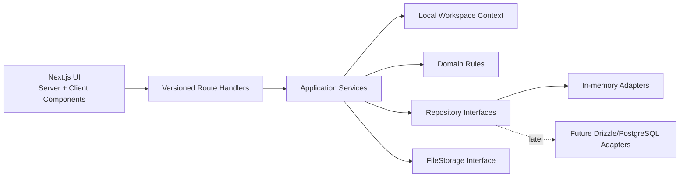

# Planisher — Product, Architecture, and Build Plan

Status: Approved for local desktop prototype execution  
Prepared: 2026-07-04  
Scope: Local desktop development first. Authentication, production billing, mobile-specific development, and production infrastructure are deferred.

## 1. Executive summary

Planisher is a construction planning SaaS for everyone from a person building one house to a construction company managing many projects. Its core promise is:

> Turn a construction plan into one calm, shared source of truth for schedule, work, cost, files, and decisions.

The first release will let a user:

- use a preconfigured local workspace and demo user without signing in;
- create, archive, and duplicate projects;
- create hierarchical tasks and dependencies;
- plan and edit work in a Gantt chart;
- track task dates, assignees, descriptions, progress-derived schedule status, attachments, and comments;
- see an append-only audit trail of changes;
- build a project budget and record committed/actual costs;
- create reusable project templates;
- control access at both workspace and project level.

The build will follow the requested order:

1. approve the product and technical plan;
2. build the complete interface against typed mock data;
3. implement the backend, in-memory repositories, and ORM schemas with a local demo identity;
4. wire the approved interface to the backend;
5. harden, test, and prepare the database migration path.

The initial runtime data store will be an in-memory, object-based store. It is deliberately a development/demo adapter: restarting the server erases data. Domain services will depend on repository interfaces, and Drizzle ORM PostgreSQL schemas will be defined at the same time. Replacing the memory repositories with PostgreSQL repositories later must not require changing the UI or business rules.

## 2. Product position

### 2.1 The problem

Construction projects last months or years and involve people who do not all work in the same office or use the same tools. Schedules live in spreadsheets, decisions disappear into chats, costs arrive late, and the owner cannot easily answer:

- What should be happening today?
- What is late or likely to become late?
- Who owns the next action?
- What changed, who changed it, and why?
- What was budgeted, committed, and actually spent?
- Can the successful plan from the last house be reused?

Planisher should answer those questions without making a homeowner learn enterprise project-management jargon.

### 2.2 Initial target customers

The product can eventually serve a wide range, but the first paid customer profile should be narrower:

1. small and mid-sized residential builders managing 2–25 simultaneous projects;
2. general contractors and specialty contractors who have outgrown spreadsheets;
3. owner-builders/homeowners who need a guided version of the same planning model.

Large high-rise and enterprise customers remain an architectural requirement, not the first-release feature target. Their later needs—SSO, portfolio resource planning, advanced working calendars, contractual workflows, and regulatory controls—must not distort the first usable release.

### 2.3 Product principles

- **Schedule first:** the timeline is the main working surface, not a report hidden in a menu.
- **Progressive disclosure:** a homeowner sees a simple plan; a construction manager can open dependencies, cost codes, and audit detail.
- **One fact, one home:** dates are changed on the task, not copied between unrelated views.
- **Fast daily updates:** common field updates should require a few taps.
- **Safe reuse:** duplication copies the plan, not historical noise or sensitive actual costs by accident.
- **Explain schedule status:** blue, red, green, and gray states must have plain-language labels.
- **Local first:** prove the planning workflow before adding authentication, billing, or production infrastructure.
- **Construction collaboration should not be taxed:** restricted clients and subcontractor guests should not require full paid seats.
- **Accessible status:** color is never the only signal.

## 3. Scope

### 3.1 MVP features

#### Workspaces and people

- One preconfigured local workspace and demo user.
- Seeded team members for assignments and UI demonstration.
- No sign-in, invitation, workspace switching, or role-management flow in the local prototype.
- The domain keeps workspace/user IDs so multi-tenant authentication can be added later without reshaping project data.

#### Projects

- Create, edit, archive, restore, and duplicate a project.
- Project name, code, description, location, and dates.
- Timezone is detected from the browser; currency is inferred from the browser locale/region. Neither is a required project-creation field.
- Project progress and display status are derived from its leaf tasks rather than entered manually.
- Project cards and searchable/filterable project list.
- Project overview with overall progress, schedule status, budget summary, and recent activity.
- Convert a project plan to a reusable template.
- Start a project from a blank plan or template.

#### Tasks and schedule

- Summary tasks, child tasks, regular tasks, and milestones.
- Start date, end date, description, priority, progress, and assignees.
- Finish-to-start dependencies in the first UI; the data model supports all four dependency types.
- Reorder and reparent tasks.
- Inline editing in grid/list and drag/resize in the Gantt chart.
- Day, week, month, quarter, and fit-to-project timeline controls.
- Search and filters for assignee, progress-derived schedule status, and date range.
- Bulk progress/assignee updates.
- Configurable working week, initially Monday–Friday with weekend visualization.
- Derived project progress from leaf tasks.

#### Collaboration

- Task comments with edit history marker and user mentions.
- Task and project attachments.
- Activity feed.
- Append-only mutation audit trail with actor, time, action, entity, and before/after summary.

#### Costing and budgeting

- One automatically detected project currency, inherited from the local workspace.
- Budget lines with cost code/category, description, optional task link, planned amount, committed amount, actual amount, and forecast.
- Cost entries for commitment and actual spend.
- Budget summary: planned, committed, actual, forecast, remaining, and variance.
- Cost access controlled separately from general project access.

#### Product operation

- Feature entitlement checks for pricing plans.
- Usage counts for active projects, full members, storage, and tasks.
- Empty, loading, permission-denied, validation, and recoverable error states.
- Seeded demo workspace and resettable in-memory data.

### 3.2 Explicitly outside the MVP

- Native iOS/Android apps; the web app will be responsive.
- Mobile-specific layouts and interactions; the local prototype is desktop-first.
- Sign-up, sign-in, password reset, email verification, invitations, sessions, roles, and other login-required work.
- Production multi-tenancy and authorization enforcement.
- Full drawing markup, BIM, takeoff, procurement, payroll, time clock, and equipment management.
- RFIs, submittals, punch lists, change-order approval, invoicing, and accounting integrations.
- Real-time multi-cursor collaboration.
- Cross-project resource leveling.
- Critical-path calculation and automated rescheduling.
- Offline synchronization.
- Multiple currencies inside one project.
- Legal-grade document signatures.
- SAML/SCIM implementation; the authorization model will leave room for them.
- Permanent file or database storage in the initial adapter.
- Production billing, checkout, and plan-entitlement enforcement.

### 3.3 Definition of an “interaction” for audit

For the local prototype, “audit every interaction” means every state-changing business action:

- project/task/budget/comment/file/member changes;
- project duplication/template creation;
- archive, restore, and export operations.

Ordinary reads, mouse movement, filters, and page views will not enter the business audit feed in the MVP. They create noise and may introduce privacy concerns. Authentication and security events are added when login support is implemented.

## 4. Personas and primary journeys

### 4.1 Personas

| Persona | Primary need | Default experience |
| --- | --- | --- |
| Owner-builder/homeowner | Know what happens next and whether the build is on time/budget | Guided template, simple statuses, overview |
| Company owner | Portfolio visibility, risk, cost, accountability | Dashboard, projects, budget, audit |
| Project manager | Build and maintain the schedule | Gantt, dependencies, assignments, bulk edit |
| Site supervisor/foreman | Update current work quickly | Today/assigned list, progress, photos/comments |
| Finance manager | Track commitments, spend, and variance | Budget and cost-entry views |
| Subcontractor | See and update assigned work | Restricted assigned tasks and comments |
| Client/stakeholder | Follow progress without editing the plan | Read-only overview/timeline and comments |
| Workspace administrator | Future management of people, security, and product settings | Deferred until authentication is added |

### 4.2 Critical journeys

#### First-run journey

1. User starts the local development server.
2. Planisher opens directly into a seeded local workspace—no login required.
3. User chooses “Create project,” “Use template,” or “Explore demo.”
4. User starts blank, selects a template, or opens seeded demo data.
5. User lands in the project schedule with a three-step contextual checklist.

#### Daily project-manager journey

1. Open dashboard and see overdue/at-risk projects.
2. Open a project’s Schedule tab.
3. Filter to “delayed.”
4. Drag a task date or update progress.
5. See project progress and schedule status recalculate.
6. Add a comment/mention explaining the change.
7. Confirm the activity feed records the action.

#### Field update journey

1. Open “My work.”
2. Select a task due today.
3. Set progress, add a short note, and attach a photo.
4. Save in one action.
5. Project progress and audit update immediately.

#### Duplicate-plan journey

1. Choose Duplicate on a project or template.
2. Enter the new project name and intended start date.
3. Choose optional inclusions: planned budget and same-workspace assignments.
4. Review exclusions: comments, audit history, actual/committed costs, and attachments.
5. Planisher clones tasks and rewrites parent/dependency IDs atomically.
6. New project opens with progress reset and dates shifted by the chosen offset.

## 5. Information architecture and interface plan

### 5.1 Local application routes

- `/` — redirect to the local workspace dashboard
- `/about` — optional product introduction

- `/app` — workspace dashboard
- `/app/my-work`
- `/app/projects`
- `/app/projects/new`
- `/app/projects/[projectId]/overview`
- `/app/projects/[projectId]/schedule`
- `/app/projects/[projectId]/budget`
- `/app/projects/[projectId]/files`
- `/app/projects/[projectId]/activity`
- `/app/projects/[projectId]/settings`
- `/app/templates`
- `/app/settings/local`

Authentication, invitation, people-management, security, and billing routes are intentionally absent from the local prototype.

### 5.3 Application shell

Desktop:

- collapsible left navigation;
- global create button;
- project switcher/breadcrumb;
- search/command palette;
- local workspace label and locale summary;
- primary content region with stable project tabs.

The first implementation targets desktop widths. It should avoid needless breakage at narrower widths, but mobile navigation, mobile Gantt behavior, and touch-specific interactions are deferred.

### 5.4 Dashboard

The dashboard should answer “Where do I need to look?” rather than display decorative charts.

- active project cards with completion and schedule status;
- delayed task count;
- work due this week;
- budget variance summary, visible only with cost permission;
- recent activity;
- quick actions: new project and use template;
- empty state that starts project creation.

### 5.5 Project workspace

Persistent project header:

- project name/code and derived progress status;
- planned date range;
- progress;
- schedule-status badge (`On time`, `Delayed`, or `Completed`);
- project members;
- favorite/overflow menu;
- tabs for Overview, Schedule, Budget, Files, Activity, Settings.

### 5.6 Schedule/Gantt workspace

Desktop layout:

- toolbar: add task, add milestone, undo placeholder, view scale, fit, filters, search, today, full-screen;
- resizable left task grid;
- right Gantt timeline;
- optional right task-detail drawer;
- selection-aware bulk action bar.

Grid columns:

- drag handle/tree expander;
- task name;
- assignee avatars;
- start;
- finish;
- duration;
- progress;
- progress/schedule status.

Task bar contents:

- task title when space permits;
- progress fill;
- dependency handles;
- completion/status icon;
- tooltip with dates, assignee, progress, and schedule-status explanation.

Interaction rules:

- single click selects;
- double click or Enter opens details;
- drag moves dates;
- resize changes duration;
- dependency drag creates a link;
- all destructive actions require confirmation or an immediate undo affordance;
- server rejection returns the bar to its prior position and explains why.

### 5.7 Task detail

Sections:

- title, progress status, schedule status, and priority;
- start/end/duration/progress;
- parent and dependencies;
- assignees;
- description;
- linked budget lines;
- attachments;
- comments;
- compact activity list.

Desktop uses a 440–520 px drawer so the schedule remains visible.

### 5.8 Budget

- summary cards for planned, committed, actual, forecast, remaining, and variance;
- table grouped by cost code/category;
- filters for task, category, variance, and entry type;
- add/edit budget-line drawer;
- cost-entry drawer;
- task drawer shortcuts for “Add budget” and “Add expense” create the same
  task-linked budget lines and cost entries used by the full budget workspace;
- simple cumulative planned-vs-actual chart after the core table works;
- export action reserved for a later entitlement.

Money is stored as integer minor units, never floating-point values. A project has one currency in the MVP. The workspace currency is automatically inferred from the browser locale/region on first load and inherited by new projects.

### 5.9 Audit/activity

- human-readable sentence first;
- actor, exact timestamp, entity, and action;
- expandable before/after details;
- filters by actor, entity type, action, and date;
- cursor-based pagination;
- binary attachment contents and future authentication secrets are never recorded.

### 5.10 Visual language

- calm neutral background with high-contrast working surfaces;
- blue for on-time work;
- green for completed work;
- red for delayed work;
- gray for not-yet-started work;
- patterned or outlined variants so status is not encoded by color alone.

The interface should feel closer to a well-made field notebook than a financial trading terminal.

## 6. Progress and schedule-status rules

### 6.1 Task progress and display status

The only manually updated execution value is task progress (`0–100`). Planisher derives the visible task status:

| Status | Rule | Presentation |
| --- | --- | --- |
| Completed | progress = 100 | Green + check |
| Delayed | end date is before today and progress < 100 | Red + delayed label |
| On time | task has started or is due today/future and progress < 100 | Blue + on-time label |
| Not started | progress = 0 and start date is after today | Gray + not-started label |

There is no separate editable “health” field and no warning/at-risk algorithm in the local prototype. This keeps the meaning obvious: progress is entered; status and color are calculated.

### 6.2 Project progress and status

Default project progress is duration-weighted across leaf tasks:

`sum(task progress × task working-day duration) / sum(task working-day duration)`

Milestones count as one working-day unit only after completion. Summary-task progress is derived from leaf tasks and is not editable.

The project’s visible status is also derived:

- `COMPLETED` when overall project progress is 100%;
- `DELAYED` when at least one incomplete leaf task is past its end date;
- `ON_TIME` otherwise;
- `NOT_STARTED` when all leaf-task progress is 0 and all task start dates are in the future.

Project archive state is stored separately and does not alter this calculation.

### 6.3 Automatic locale, timezone, and currency

- Detect timezone with `Intl.DateTimeFormat().resolvedOptions().timeZone`.
- Detect locale from the browser language preferences.
- Infer currency from the locale’s region using a small explicit region-to-currency map.
- Fall back to `UTC` and `USD` only when detection is unavailable or ambiguous.
- Store the detected values on the local workspace and inherit them in new projects.
- Show the detected values in local settings so they are transparent and can be corrected, but do not require them during project creation.

### 6.4 Date semantics

- Project/task schedule fields are date-only values in the project timezone.
- Audit timestamps are UTC instants displayed in the viewer’s timezone.
- End dates are inclusive in the UI.
- Dependency lag is stored in working days.
- Invalid ranges and dependency cycles are rejected by the domain service.

## 7. Gantt library decision

### 7.1 Recommended library

Use **DHTMLX Gantt Community Edition v10+** behind a small Planisher adapter component.

Reasons:

- MIT license permits a commercial closed-source SaaS;
- task hierarchy, milestones, dependencies, inline editing, drag-and-drop, zoom, smart rendering, keyboard navigation, accessibility, and React integration;
- the community edition is enough for the MVP;
- a commercial upgrade path exists for critical path, auto-scheduling, resource management, and other enterprise features.

DHTMLX v10 Community Edition is new as of June 2026, so implementation begins with a one-day spike. The adapter must keep DHTMLX-specific task shapes and events out of domain/UI code.

Fallback: **SVAR React Gantt open-source edition**, also MIT licensed, if the spike exposes a blocking React, accessibility, or packaging issue. It supports the core hierarchy, dependency, editing, and styling requirements.

Do not use DHTMLX v9 or earlier; its free edition uses GPL terms. Pin v10 or later and keep the license notice in the third-party notices file.

### 7.2 Spike acceptance criteria

- renders 2,000 seeded tasks smoothly;
- supports task hierarchy and milestones;
- supports drag, resize, inline edit, and dependency creation;
- custom task colors/progress and accessible labels work;
- dynamically imports in Next.js without SSR errors;
- change events can be intercepted and reverted after simulated API failure;
- no required MVP feature is PRO-only;
- bundle and styling do not contaminate unrelated pages.

## 8. Local prototype identity and deferred authorization

### 8.1 Local identity

The current execution phase has no login requirement.

- The application opens directly into one seeded local workspace.
- A constant local actor identifies changes in the audit feed.
- Seeded team members may be assigned to tasks, but they are not authenticated accounts.
- All local routes are directly accessible.
- A visible “Local demo — data resets on restart” label prevents the prototype from being mistaken for a production system.

This removes authentication complexity from the UI and backend while preserving `organizationId`, `createdBy`, and assignee IDs in domain records.

### 8.2 Local access model

- The local actor can create and edit all seeded data.
- No role checks, invitations, sessions, or entitlement enforcement run in this phase.
- Repository methods still require an `organizationId` so future tenant boundaries are not erased.
- The frontend receives a simple capability object, currently all enabled, rather than hard-coding permission assumptions in every component.

### 8.3 Deferred production model

When persistent multi-user development begins:

- use Better Auth with its Next.js integration and organization plugin;
- add email/password, verification, reset, secure sessions, and invitations;
- enforce workspace and project roles on the server;
- add OAuth/2FA only when the core account flow is stable;
- use SAML SSO and SCIM only for a validated enterprise need;
- switch Better Auth from its development adapter to Drizzle/PostgreSQL.

The previously proposed roles remain a future design target: workspace `OWNER`, `ADMIN`, `MEMBER`, and `EXTERNAL`; project `PROJECT_MANAGER`, `SCHEDULER`, `FINANCE`, `CONTRIBUTOR`, and `VIEWER`.

### 8.4 Local security baseline

- Zod validation at every network boundary;
- sanitized text for descriptions and comments;
- attachment type, name, and size validation;
- no secrets in client bundles;
- log/audit redaction;
- dependency and license scanning;
- bind the local development server to loopback by default.

## 9. Pricing recommendation

### 9.1 Pricing model

Use a hybrid **workspace subscription + included full seats + free restricted guests** model.

Why:

- a homeowner needs a credible free entry point;
- builders need predictable costs;
- per-user pricing discourages inviting subcontractors and clients;
- annual-construction-volume pricing penalizes customer growth and is hard to understand;
- active-project, seat, and storage limits map to real product value and infrastructure cost.

Do not charge by project budget or annual construction volume. Archived projects should not count toward active-project limits.

### 9.2 Proposed launch tiers

Prices are validation hypotheses, not immutable commitments.

| Plan | Annual billing equivalent | Monthly billing | Included use |
| --- | ---: | ---: | --- |
| Personal | $0 | $0 | 1 active project, 1 full member, 3 guests, 250 tasks, 500 MB, core schedule/comments/basic budget |
| Builder | $29/mo | $39/mo | 5 active projects, 3 full members, unlimited restricted guests, 5 GB, templates, full audit, attachments |
| Company | $79/mo | $99/mo | 25 active projects, 10 full members, unlimited restricted guests, 50 GB, advanced budget, portfolio dashboard, exports |
| Business | $199/mo | $249/mo | Unlimited active projects, 25 full members, 250 GB, custom roles, advanced security, priority support |
| Enterprise | Custom annual | Custom | SSO/SCIM, dedicated environment options, custom retention, SLA, onboarding, integrations |

Suggested additional full member:

- $8/member/month on annual billing;
- $10/member/month on monthly billing.

Restricted guests:

- only assigned projects;
- no workspace administration;
- no portfolio browsing;
- no cost access unless explicitly granted;
- comments, uploads, and assigned-task updates only;
- free across paid tiers to encourage adoption.

### 9.3 Packaging rules

- 14-day Company trial, no card required.
- Trial converts to Personal unless a plan is selected.
- Annual billing discount is approximately 20%.
- Upgrades apply immediately and prorate.
- Downgrades take effect at renewal; over-limit workspaces become read-only for new resources until usage is reduced.
- Never delete customer data immediately because a payment fails.
- Give a clear grace period and export path.
- Taxes and regional currencies are handled by the billing provider later.
- Entitlements live in Planisher’s own `Plan/Subscription/Entitlement` service even when Stripe becomes the payment processor.

### 9.4 Pricing validation before launch

Interview at least:

- 5 owner-builders/homeowners;
- 10 small builders/contractors;
- 5 project managers at larger companies.

Test willingness to pay, guest expectations, active-project limits, and whether budget/audit belong in Builder or Company. Use landing-page and concierge pilots before polishing all billing screens.

Market context as of 2026-07-04:

- Fieldwire publicly ranges from free to per-user paid plans and allows a small free team.
- Buildertrend uses custom pricing and advertises unlimited users/projects.
- Procore prices by products and annual construction volume.
- General work-management tools use low per-seat tiers.

Planisher’s opportunity is transparent pricing between generic work management and expensive construction suites.

## 10. Technical architecture

### 10.1 Recommended stack

| Area | Choice | Reason |
| --- | --- | --- |
| Application | Next.js App Router + TypeScript | One deployable web application, server/client component model |
| Package manager | pnpm | Fast, strict dependency management |
| UI | Tailwind CSS + shadcn/ui/Radix primitives + Lucide | Accessible, composable, locally owned UI |
| Gantt | DHTMLX Gantt Community v10+ via adapter | MIT, capable scheduling surface |
| Forms | React Hook Form + Zod | Performant forms and shared validation |
| Client server-state | TanStack Query | Optimistic Gantt/task mutations and cache invalidation |
| Dates | date-fns | Date-only/working-day calculations |
| ORM schemas | Drizzle ORM for PostgreSQL | Type-safe code-first schema and migrations |
| Runtime store first | In-memory Maps behind repositories | Meets demo requirement and stays replaceable |
| Local identity | Seeded workspace and local actor | No login required during local development |
| Authentication later | Better Auth + organization plugin | Deferred until persistent multi-user work |
| API | Versioned Next.js Route Handlers | Stable JSON contract for the frontend and future integrations |
| Tests | Vitest + Testing Library + Playwright | Unit, component, integration, and end-to-end coverage |
| Logging | Structured JSON logger with request IDs | Traceable service/audit operations |
| Files | `FileStorage` interface + memory adapter | Later replace with S3/R2-compatible object storage |
| Billing later | Stripe behind `BillingProvider` | Deferred until the local product workflow is validated |

Pin exact stable versions when execution starts and record them in the lockfile. Do not use floating “latest” versions in CI.

### 10.2 Architectural boundaries



Rules:

- React components never import a repository.
- Route handlers validate input and delegate; they do not contain business rules.
- Application services coordinate policy, domain rules, repositories, and audit.
- Repositories retain organization scope; production authorization is deferred.
- Gantt-library objects are converted at the schedule adapter boundary.
- The in-memory and PostgreSQL repositories must pass the same contract test suite.

### 10.3 Suggested source structure

```text
src/
  app/
    (marketing)/
    app/
    api/v1/
  components/
    ui/
    layout/
    projects/
    schedule/
    budget/
    activity/
  features/
    organizations/
    projects/
    tasks/
    schedule/
    budget/
    comments/
    attachments/
    audit/
  server/
    application/
    local-context/
    domain/
    repositories/
      contracts/
      memory/
      drizzle/
    storage/
    audit/
  db/
    schema/
    migrations/
  lib/
    api/
    dates/
    money/
    validation/
  test/
    factories/
    contract/
    e2e/
```

Feature code can contain its UI and validation, but server-only modules must be protected with `server-only`.

### 10.4 API conventions

- Base path: `/api/v1`.
- JSON uses camelCase; ORM columns use snake_case.
- Date-only values are `YYYY-MM-DD`.
- Timestamps are ISO 8601 UTC.
- Money is serialized as integer minor units plus currency.
- List endpoints use cursor pagination where data grows indefinitely.
- Mutations accept an `expectedVersion` for optimistic concurrency on schedule and budget records.
- Every response/request receives a request ID.

Error shape:

```json
{
  "error": {
    "code": "TASK_VERSION_CONFLICT",
    "message": "This task changed after you opened it.",
    "fieldErrors": {},
    "requestId": "..."
  }
}
```

Core endpoints:

```text
GET/POST    /api/v1/projects
GET/PATCH   /api/v1/projects/:projectId
POST        /api/v1/projects/:projectId/archive
POST        /api/v1/projects/:projectId/duplicate
GET/POST    /api/v1/projects/:projectId/tasks
PATCH       /api/v1/projects/:projectId/tasks/:taskId
POST        /api/v1/projects/:projectId/tasks/bulk
POST/DELETE /api/v1/projects/:projectId/dependencies
GET/POST    /api/v1/projects/:projectId/comments
GET/POST    /api/v1/projects/:projectId/attachments
GET/POST    /api/v1/projects/:projectId/budget-lines
GET/POST    /api/v1/projects/:projectId/cost-entries
GET         /api/v1/projects/:projectId/audit-events
GET         /api/v1/organizations/:organizationId/assignees
GET         /api/v1/me/work
```

### 10.5 In-memory store

Use one process-wide store held behind `globalThis` during development to survive Next.js hot reload:

```text
Map<tableName, Map<id, record>>
```

Requirements:

- repository methods return copies, not mutable internal references;
- indexes for organization, project, assignee, and task parent;
- deterministic seed/reset functions;
- monotonic record version for optimistic concurrency;
- atomic application-service operation using clone/validate/commit for multi-record changes;
- a fresh isolated store per unit/integration test;
- memory file adapter with strict per-file and total-size limits;
- no claim that the memory adapter is production safe.

### 10.6 Database migration path

1. Define Drizzle PostgreSQL schema and migrations now.
2. Keep domain types independent of Drizzle row types.
3. Run repository contract tests against memory.
4. When persistence is approved, provision managed PostgreSQL.
5. Implement Drizzle repositories against the existing interfaces.
6. Run the same contract and tenant-isolation tests.
7. Switch dependency injection by environment variable.
8. Add transaction/outbox behavior for audit and notifications.
9. Move files to S3/R2-compatible storage.
10. Remove the demo reset warning only after backups and restore tests exist.

Do not attempt to migrate ephemeral demo data unless specifically required.

## 11. Data model

All IDs are UUIDs. All tenant product tables include `organizationId`, even when it can be reached through a project relationship; this supports explicit tenant scoping and indexing.

### 11.1 Local workspace and future identity

#### `users`

- Deferred as an authentication table. The prototype seeds compatible user-shaped assignee records.
- `id`
- `name`
- `email` unique, normalized
- `emailVerified`
- `image`
- `locale`
- `createdAt`, `updatedAt`

#### `sessions`, `accounts`, `verifications`

Deferred until authentication work begins.

#### `organizations`

- `id`
- `name`
- `slug`
- `logo`
- `defaultTimezone`
- `defaultCurrency`
- `createdAt`, `updatedAt`

#### `members`

- `id`
- `organizationId`
- `userId`
- `role` (`OWNER`, `ADMIN`, `MEMBER`, `EXTERNAL`)
- `status`
- `createdAt`, `updatedAt`
- unique `(organizationId, userId)`

#### `invitations`

Deferred until authentication work begins.

### 11.2 Projects and schedule

#### `projects`

- `id`, `organizationId`
- `kind` (`PROJECT`, `TEMPLATE`)
- `sourceProjectId` nullable
- `name`, `code`, `description`, `location`
- `startDate`, `endDate`
- `timezone`, `currency`
- `workingWeek` JSON
- `progressMode`
- `version`
- `createdBy`, `createdAt`, `updatedAt`, `archivedAt`
- unique `(organizationId, code)` where appropriate

Project progress and `NOT_STARTED`/`ON_TIME`/`DELAYED`/`COMPLETED` display status are computed from leaf tasks and are not stored as editable project fields.

#### `project_members`

- `id`, `organizationId`, `projectId`, `userId`
- `projectRole`
- `canViewCosts` optional override
- `createdAt`, `updatedAt`
- unique `(projectId, userId)`

#### `tasks`

- `id`, `organizationId`, `projectId`
- `parentTaskId` nullable
- `type` (`TASK`, `MILESTONE`, `SUMMARY`)
- `title`, `description`
- `priority`
- `startDate`, `endDate`
- `progress` integer 0–100
- `sortOrder`
- `version`
- `createdBy`, `createdAt`, `updatedAt`, `completedAt`
- indexes `(projectId, parentTaskId, sortOrder)` and `(projectId, startDate, endDate)`

Task display status is derived from progress, dates, and today; it is not a separate editable column.

#### `task_assignees`

- `id`, `organizationId`, `projectId`, `taskId`, `userId`
- unique `(taskId, userId)`

#### `task_dependencies`

- `id`, `organizationId`, `projectId`
- `predecessorTaskId`, `successorTaskId`
- `type` (`FS`, `SS`, `FF`, `SF`)
- `lagWorkingDays`
- unique dependency tuple
- domain validation prevents self-links and cycles

### 11.3 Collaboration

#### `comments`

- `id`, `organizationId`, `projectId`, `taskId` nullable
- `authorId`
- `body`
- `createdAt`, `updatedAt`, `deletedAt`

#### `comment_mentions`

- `id`, `commentId`, `userId`

#### `attachments`

- `id`, `organizationId`, `projectId`
- `taskId` nullable, `commentId` nullable
- `uploadedBy`
- `storageKey`, `fileName`, `contentType`, `sizeBytes`, `checksum`
- `createdAt`, `deletedAt`

#### `audit_events`

- `id`, `organizationId`, `projectId` nullable
- `actorUserId` nullable for system events
- `action`
- `entityType`, `entityId`
- `summary`
- redacted `before`, `after`, `metadata` JSON
- `requestId`, `ipHash` nullable
- `occurredAt`
- append-only; no normal update/delete repository methods

### 11.4 Budget and cost

#### `budget_lines`

- `id`, `organizationId`, `projectId`, `taskId` nullable
- `costCode`, `category`, `description`
- `plannedMinor`
- `currency`
- `version`
- `createdBy`, `createdAt`, `updatedAt`

#### `cost_entries`

- `id`, `organizationId`, `projectId`, `budgetLineId`
- `type` (`COMMITMENT`, `ACTUAL`, `FORECAST_ADJUSTMENT`)
- `amountMinor`, `currency`
- `vendor`, `reference`, `occurredOn`, `note`
- `createdBy`, `createdAt`, `updatedAt`, `voidedAt`

Committed, actual, forecast, remaining, and variance values are derived server-side from these records rather than accepted as trusted totals from the browser.

### 11.5 Billing/entitlements

#### `subscriptions`

- `id`, `organizationId`
- `provider`, `providerCustomerId`, `providerSubscriptionId`
- `planKey`, `status`
- `currentPeriodStart`, `currentPeriodEnd`, `cancelAtPeriodEnd`

#### `usage_counters`

- `organizationId`
- `activeProjects`, `fullMembers`, `storageBytes`, `taskCount`
- `updatedAt`

During the demo milestone, a seeded subscription record selects a plan; no real payment is taken.

## 12. Project duplication specification

Duplication must be a domain operation, not a series of client calls.

### 12.1 Default copied data

- project description/settings, currency, timezone, and working week;
- all tasks, hierarchy, durations, sort order, and dependencies;
- task descriptions and priorities;
- planned budget lines if the user selects the option;
- same-workspace assignees only if the user selects the option.

### 12.2 Default transformations

- new IDs for every project-owned record;
- new project name/code;
- dates shifted so the source start equals the requested new start;
- progress resets to 0;
- completion timestamps clear;
- source project/template ID recorded;
- one `PROJECT_DUPLICATED` audit event describes the source and options.

### 12.3 Never copied by default

- comments and mentions;
- attachments;
- audit history;
- committed/actual cost entries;
- deleted/archived records;
- external assignees not present in the target workspace.

### 12.4 Algorithm

1. Authorize source read and target project creation.
2. Validate target plan limits and unique code.
3. Read a consistent source snapshot.
4. Create maps from old project/task/budget IDs to new IDs.
5. Clone tasks in hierarchy order.
6. Rewrite parent IDs, dependency IDs, assignees, and optional budget task links.
7. Validate no dangling links/cycles.
8. Commit all records plus audit event atomically.
9. Return the new project summary.

## 13. Testing and quality strategy

### 13.1 Test pyramid

Unit:

- date and working-day math;
- progress and schedule-status calculations;
- money calculations;
- dependency-cycle detection;
- local capability context;
- duplication transforms;
- validation schemas.

Contract/integration:

- every repository contract against memory, later PostgreSQL;
- application services with policy and audit assertions;
- API request/response/error contracts;
- tenant-isolation attempts;
- optimistic concurrency conflicts.

Component:

- forms and drawers;
- accessible progress/schedule-status badges;
- schedule adapter event translation;
- budget summaries;
- permission-hidden/disabled actions;
- loading/empty/error states.

End to end:

- open the local workspace and complete first-run guidance;
- create project and tasks;
- edit Gantt dates and dependencies;
- update progress/comment/upload;
- budget and cost update;
- duplicate project;
- audit trail;

### 13.2 Non-functional acceptance targets

- WCAG 2.2 AA for core flows.
- Core actions operable with keyboard.
- Color status always has text/icon equivalent.
- No cross-tenant access in automated negative tests.
- Optimistic Gantt update visibly responds within 100 ms in the browser.
- Project with 2,000 tasks remains usable on a representative laptop.
- Initial local application shell aims for LCP below 2.5 seconds under a normal broadband profile.
- No high/critical production dependency vulnerabilities at release.
- No unhandled console errors in core Playwright journeys.

## 14. Delivery phases and small-task backlog

Sizing:

- `XS`: up to half a focused day;
- `S`: about one focused day;
- `M`: one to two focused days.

Tasks larger than `M` must be split before implementation. IDs are stable for issues/commits.

### Gate A — Plan approval

Deliverable: this document is reviewed and the MVP boundary, pricing hypothesis, roles, and Gantt choice are accepted.

#### Phase 0 — Product and repository foundation

- [x] `P0-01` Approve or amend the MVP and non-MVP lists. `XS`
- [x] `P0-02` Approve target customer priority and core positioning. `XS`
- [x] `P0-03` Approve role names and permission defaults. `XS`
- [x] `P0-04` Approve pricing as a validation hypothesis. `XS`
- [x] `P0-05` Initialize Git repository and branch policy. `XS`
- [x] `P0-06` Scaffold current stable Next.js with TypeScript and pnpm. `S`
- [x] `P0-07` Add formatting, linting, type-check, and test scripts. `S`
- [ ] `P0-08` Create environment-variable schema and example file. `XS`
- [ ] `P0-09` Add CI for install, lint, type-check, unit tests, and build. `S`
- [ ] `P0-10` Add architecture decision records for storage, deferred auth, Gantt, and money. `S`
- [ ] `P0-11` Add third-party notices and dependency-license check. `XS`
- [x] `P0-12` Define typed frontend mock contracts for workspace, project, task, budget, and audit. `S`
- [x] `P0-13` Implement browser timezone/locale/currency detection with explicit fallbacks. `S`

Acceptance:

- clean checkout installs and passes CI;
- decisions and contracts are documented;
- no backend feature implementation begins before UI contract work.

### Gate B1 — Design system and navigation approved

#### Phase 1 — Visual foundation and static shell

- [x] `P1-01` Define color, type, spacing, radius, elevation, and motion tokens. `S`
- [ ] `P1-02` Configure Tailwind and base styles. `S`
- [ ] `P1-03` Install/configure shadcn/Radix primitives and Lucide icons. `S`
- [ ] `P1-04` Build button, input, select, checkbox, textarea, badge, avatar, and tooltip stories/showcase. `M`
- [ ] `P1-05` Build dialog, drawer/sheet, dropdown, tabs, toast, and command palette primitives. `M`
- [ ] `P1-06` Build loading skeleton, empty state, permission state, and error state. `S`
- [ ] `P1-07` Build responsive marketing header/footer. `S`
- [ ] `P1-08` Build product landing-page sections with real Planisher copy. `M`
- [ ] `P1-09` Build transparent pricing page from proposed tiers. `S`
- [ ] `P1-10` Build local-demo entry/empty state with no authentication. `S`
- [x] `P1-11` Build desktop application shell. `M`
- [x] `P1-12` Define supported desktop-width layout and overflow behavior. `S`
- [x] `P1-13` Build local workspace label and detected locale summary. `S`
- [ ] `P1-14` Build local first-run guidance. `S`
- [ ] `P1-15` Verify keyboard focus, contrast, reduced motion, and screen-reader labels. `M`

Acceptance:

- all routes render with static/mock data;
- supported desktop-width behavior is coherent;
- key controls have visible focus and accessible names.

### Gate B2 — Complete mock-data product walkthrough approved

#### Phase 2 — Static/interactive product UI

- [x] `P2-01` Build dashboard project-progress/status cards. `S`
- [x] `P2-02` Build due-this-week and delayed-work panels. `S`
- [x] `P2-03` Build recent-activity panel. `S`
- [x] `P2-04` Build project card grid, search/filter toolbar, and empty-state foundation. `M`
- [ ] `P2-05` Build create/edit project form and validation UX. `M`
- [x] `P2-06` Build project header and tab navigation. `S`
- [ ] `P2-07` Build project overview summary and next-work panels. `M`
- [ ] `P2-08` Build desktop “My work” task list with quick updates. `M`
- [x] `P2-09` Complete DHTMLX v10 Community technical spike. `M`
- [x] `P2-10` Create Planisher schedule adapter and typed event interface. `M`
- [x] `P2-11` Render mock task tree, milestones, dependencies, and progress. `M`
- [x] `P2-12` Add on-time/delayed/completed/not-started styles and accessible labels to Gantt bars. `M`
- [x] `P2-13` Build schedule toolbar, scales, today, search, and filter foundation. `M`
- [ ] `P2-14` Build mock drag, resize, reorder, and dependency interactions. `M`
- [ ] `P2-15` Build desktop task details drawer. `M`
- [ ] `P2-16` Build task create/edit form. `M`
- [ ] `P2-17` Build comment thread, composer, mentions UI, and edit indicator. `M`
- [ ] `P2-18` Build attachment list/uploader with progress and failure states. `M`
- [x] `P2-19` Build budget summary cards. `S`
- [x] `P2-20` Build budget-line table/grouping/filtering. `M`
- [x] `P2-21` Build budget-line and cost-entry drawers. `M`
- [ ] `P2-22` Build planned-vs-actual chart with accessible data alternative. `S`
- [ ] `P2-23` Build files page. `S`
- [ ] `P2-24` Build audit feed, filters, and expandable details. `M`
- [ ] `P2-25` Build project settings and member access UI. `M`
- [ ] `P2-26` Build project duplicate/template wizard. `M`
- [ ] `P2-27` Build seeded assignee picker and local team display. `S`
- [x] `P2-28` Build local settings for detected timezone/currency. `S`
- [ ] `P2-29` Apply the local capability object throughout the UI. `S`
- [ ] `P2-30` Run desktop accessibility and supported-width review. `M`

Acceptance:

- a stakeholder can complete every MVP journey with mock data;
- the interaction model is approved before APIs shape it;
- Gantt-library feasibility is proven;
- permission and limit states are visible.

### Gate C1 — Backend foundation verified

#### Phase 3 — Domain, ORM, and in-memory infrastructure

- [ ] `P3-01` Define domain IDs, date-only, money, and result/error types. `S`
- [ ] `P3-02` Implement shared Zod schemas for API contracts. `M`
- [ ] `P3-03` Define Drizzle local workspace/assignee tables; defer auth/session tables. `S`
- [ ] `P3-04` Define Drizzle project/schedule tables and indexes. `M`
- [ ] `P3-05` Define Drizzle collaboration/audit tables and indexes. `M`
- [ ] `P3-06` Define Drizzle budget/cost tables and indexes. `M`
- [ ] `P3-07` Document subscription/usage tables as deferred. `XS`
- [ ] `P3-08` Generate and review initial PostgreSQL migration files without connecting a database. `S`
- [ ] `P3-09` Define repository interfaces by aggregate/use case. `M`
- [ ] `P3-10` Implement process-wide in-memory table store. `M`
- [ ] `P3-11` Implement in-memory index and copy-on-read helpers. `S`
- [ ] `P3-12` Implement atomic clone/validate/commit unit of work. `M`
- [ ] `P3-13` Implement memory repositories for organizations/projects. `M`
- [ ] `P3-14` Implement memory repositories for tasks/dependencies/assignees. `M`
- [ ] `P3-15` Implement memory repositories for comments/attachments/audit. `M`
- [ ] `P3-16` Implement memory repositories for budget/cost; defer billing. `M`
- [ ] `P3-17` Implement deterministic demo seed/reset. `S`
- [ ] `P3-18` Implement memory `FileStorage` with limits/checksum. `M`
- [ ] `P3-19` Write reusable repository contract test suites. `M`
- [ ] `P3-20` Run all contract suites against memory adapters. `S`

Acceptance:

- ORM schemas describe the future persistent system;
- memory adapters pass contract tests;
- tests receive isolated stores;
- server restart limitation is explicit.

#### Phase 4 — Domain rules and application services

- [ ] `P4-01` Implement working-day/date-range helpers. `M`
- [ ] `P4-02` Implement task progress invariants. `S`
- [ ] `P4-03` Implement on-time/delayed/completed/not-started schedule-status calculation. `S`
- [ ] `P4-04` Implement summary/project progress calculation. `M`
- [ ] `P4-05` Implement dependency validation and cycle detection. `M`
- [ ] `P4-06` Implement project create/update/archive/restore service. `M`
- [ ] `P4-07` Implement task create/update/delete/reorder/reparent service. `M`
- [ ] `P4-08` Implement dependency create/delete service. `S`
- [ ] `P4-09` Implement bulk task update service. `M`
- [ ] `P4-10` Implement project duplication ID mapping/date shifting. `M`
- [ ] `P4-11` Implement duplication exclusions and optional copy rules. `M`
- [ ] `P4-12` Implement comment/mention service. `M`
- [ ] `P4-13` Implement attachment metadata/storage service. `M`
- [ ] `P4-14` Implement budget-line and cost-entry service. `M`
- [ ] `P4-15` Implement derived budget summary/variance calculations. `M`
- [ ] `P4-16` Implement append-only audit writer with redaction. `M`
- [ ] `P4-17` Ensure every mutation service emits one or more audit events atomically. `M`
- [ ] `P4-18` Implement dashboard and “My work” query services. `M`
- [ ] `P4-19` Add optimistic version checks and conflict errors. `M`
- [ ] `P4-20` Unit-test every domain rule and application service. `M`

Acceptance:

- services own business rules and are UI/API independent;
- multi-record operations are atomic in memory;
- every successful mutation has an audit event;
- money/date/cycle edge cases are covered.

### Gate C2 — Local context verified

#### Phase 5 — Local workspace context

- [ ] `P5-01` Implement the constant local actor provider. `XS`
- [ ] `P5-02` Implement the seeded local workspace context. `S`
- [ ] `P5-03` Expose all local application routes without authentication redirects. `XS`
- [ ] `P5-04` Implement a typed all-enabled local capability object. `XS`
- [ ] `P5-05` Attach local actor/workspace IDs to mutations and audit events. `S`
- [ ] `P5-06` Display the local reset warning in the application shell. `XS`
- [ ] `P5-07` Test that seeded records remain organization-scoped. `S`
- [ ] `P5-08` Document Better Auth, roles, invitations, and billing as deferred production work. `XS`

Acceptance:

- the application requires no sign-in;
- every record and audit event has a consistent local workspace/actor;
- restarting the memory store limitation is visibly disclosed;
- future authentication can replace the context provider without changing feature components.

### Gate C3 — Versioned API contract verified

#### Phase 6 — Route handlers

- [ ] `P6-01` Implement request ID, local workspace context, validation, and error helpers. `M`
- [ ] `P6-02` Implement project list/create/get/update routes. `M`
- [ ] `P6-03` Implement project archive/restore routes. `S`
- [ ] `P6-04` Implement duplicate/template routes. `M`
- [ ] `P6-05` Implement task list/create/update/delete routes. `M`
- [ ] `P6-06` Implement bulk/reorder/reparent task routes. `M`
- [ ] `P6-07` Implement dependency routes. `S`
- [ ] `P6-08` Implement comment/mention routes. `M`
- [ ] `P6-09` Implement attachment upload/download/delete routes. `M`
- [ ] `P6-10` Implement budget-line routes. `M`
- [ ] `P6-11` Implement cost-entry routes. `M`
- [ ] `P6-12` Implement audit list/filter/cursor route. `M`
- [ ] `P6-13` Implement dashboard and My Work routes. `M`
- [ ] `P6-14` Implement seeded assignee read route. `S`
- [ ] `P6-15` Keep subscription/usage routes deferred. `XS`
- [ ] `P6-16` Generate/maintain API contract documentation. `S`
- [ ] `P6-17` Add API integration tests for success/validation/conflict/permission cases. `M`

Acceptance:

- routes are thin adapters to tested services;
- response shapes match frontend contracts;
- validation and local workspace scoping apply consistently;
- conflict errors are machine-readable.

### Gate D — Frontend/backend wired MVP

#### Phase 7 — Wiring and client state

- [ ] `P7-01` Create typed API client and normalized error mapping. `M`
- [ ] `P7-02` Configure TanStack Query defaults and provider. `S`
- [ ] `P7-03` Wire local actor/workspace context. `S`
- [ ] `P7-04` Confirm all local routes work without authentication. `XS`
- [ ] `P7-05` Wire local first-run guidance and locale summary. `S`
- [ ] `P7-06` Wire dashboard queries and refresh states. `M`
- [ ] `P7-07` Wire projects list/create/edit/archive/restore. `M`
- [ ] `P7-08` Wire project header/overview. `S`
- [ ] `P7-09` Wire schedule initial task/dependency load. `M`
- [ ] `P7-10` Wire optimistic Gantt drag/resize with rollback. `M`
- [ ] `P7-11` Wire inline task edit/create/delete. `M`
- [ ] `P7-12` Wire reorder/reparent and dependency creation/deletion. `M`
- [ ] `P7-13` Wire bulk task actions. `S`
- [ ] `P7-14` Wire task drawer and server validation/conflicts. `M`
- [ ] `P7-15` Wire My Work quick updates. `M`
- [ ] `P7-16` Wire comments and mentions. `M`
- [ ] `P7-17` Wire attachment upload/progress/download/delete. `M`
- [ ] `P7-18` Wire budget lines, cost entries, and summaries. `M`
- [ ] `P7-19` Wire audit feed filters and cursor pagination. `M`
- [ ] `P7-20` Wire duplicate/template wizard and navigation. `M`
- [ ] `P7-21` Wire seeded assignee display. `S`
- [ ] `P7-22` Keep billing UI and usage enforcement deferred. `XS`
- [ ] `P7-23` Replace mock capability states with the local capability object. `S`
- [ ] `P7-24` Confirm no authentication or billing dependency enters the local bundle. `S`
- [ ] `P7-25` Remove production-path mock imports and add boundary test. `S`

Acceptance:

- every MVP journey uses backend state;
- optimistic schedule edits roll back on failure;
- validation and conflict failures are understandable;
- restarting the demo resets data as documented.

### Gate E — Release candidate

#### Phase 8 — End-to-end quality, security, and polish

- [ ] `P8-01` Write Playwright onboarding/project-creation journey. `M`
- [ ] `P8-02` Write Playwright Gantt editing/dependency journey. `M`
- [ ] `P8-03` Write Playwright field update/comment/upload journey. `M`
- [ ] `P8-04` Write Playwright budget/cost journey. `M`
- [ ] `P8-05` Write Playwright duplicate/template journey. `M`
- [ ] `P8-06` Write Playwright local reset/seed journey. `S`
- [ ] `P8-07` Write Playwright audit journey. `S`
- [ ] `P8-08` Test 2,000-task Gantt and optimize hotspots. `M`
- [ ] `P8-09` Run automated accessibility scan and manual keyboard review. `M`
- [ ] `P8-10` Review supported desktop widths and overflow behavior. `S`
- [ ] `P8-11` Threat-model local data boundaries, uploads, and audit redaction. `M`
- [ ] `P8-12` Run dependency/license/security scans and remediate release blockers. `M`
- [ ] `P8-13` Add structured logs and request correlation. `S`
- [ ] `P8-14` Add safe global error handling and support request ID display. `S`
- [ ] `P8-15` Finalize demo seed narrative and reset control. `S`
- [ ] `P8-16` Write developer setup, architecture, and data-reset documentation. `M`
- [ ] `P8-17` Write user-facing quick-start guide. `S`
- [ ] `P8-18` Run release checklist and record known limitations. `S`

Acceptance:

- all critical end-to-end journeys pass;
- no high-severity security/accessibility issue remains;
- 2,000-task target is usable;
- setup and limitations are documented.

#### Phase 9 — Persistence and production billing, after wired MVP approval

- [ ] `P9-01` Select managed PostgreSQL provider/region and recovery objectives. `S`
- [ ] `P9-02` Provision development/staging PostgreSQL. `S`
- [ ] `P9-03` Implement Drizzle repositories behind existing contracts. `M`
- [ ] `P9-04` Run repository and tenant-isolation suites against PostgreSQL. `M`
- [ ] `P9-05` Configure Better Auth Drizzle adapter and migrations. `M`
- [ ] `P9-06` Add transactions for service mutation plus audit. `M`
- [ ] `P9-07` Select/provision S3-compatible object storage. `S`
- [ ] `P9-08` Implement object-storage adapter and signed access. `M`
- [ ] `P9-09` Add malware-scanning/quarantine workflow for files. `M`
- [ ] `P9-10` Add backup, restore, and migration rollback runbooks. `M`
- [ ] `P9-11` Integrate Stripe customer/subscription webhooks behind `BillingProvider`. `M`
- [ ] `P9-12` Add checkout, portal, proration, and failed-payment lifecycle. `M`
- [ ] `P9-13` Test webhook idempotency and entitlement synchronization. `M`
- [ ] `P9-14` Add production email provider/templates. `M`
- [ ] `P9-15` Add observability, alerting, retention, and incident runbook. `M`
- [ ] `P9-16` Perform staging migration/restore/recovery rehearsal. `M`

## 15. Milestones and rough effort

For one experienced full-stack engineer, the complete in-memory MVP is roughly 12–16 focused weeks after plan approval. Two engineers can reduce elapsed time, but not by half because UI decisions, Gantt integration, contracts, and end-to-end stabilization are sequential.

| Milestone | Outcome | Rough single-engineer elapsed effort |
| --- | --- | --- |
| M0 | Foundation and approved contracts | 1 week |
| M1 | Complete static/mock UI | 3–4 weeks |
| M2 | Domain, memory backend, local context, APIs | 3–4 weeks |
| M3 | Wired functional MVP | 2–3 weeks |
| M4 | Security, accessibility, performance, release candidate | 2–3 weeks |
| M5 | PostgreSQL/files/billing productionization | Separate 3–5 week phase |

These are planning ranges, not commitments. Re-estimate after the Gantt spike and after static UI approval.

## 16. Risks and mitigations

| Risk | Consequence | Mitigation |
| --- | --- | --- |
| In-memory data mistaken for production readiness | Data loss and broken multi-instance deployment | Persistent warning, adapter boundary, no production claim |
| New DHTMLX v10 Community release has integration regressions | Schedule delays | One-day spike, adapter isolation, SVAR fallback |
| “Simple” Gantt scope grows into Primavera | MVP never ships | Explicit exclusions; hierarchy/dependencies/manual dates first |
| Large-enterprise requirements distort homeowner UX | Product becomes intimidating | Progressive disclosure and first-customer priority |
| Client-side role checks leak data | Security incident | Server policy guards plus negative tenant tests |
| Budget totals use floating point | Financial inaccuracies | Integer minor units and server-derived totals |
| Duplicating history/actual costs leaks sensitive information | Trust and privacy failure | Safe default exclusions and atomic domain operation |
| Free guests are abused as full seats | Revenue leakage | Restricted capabilities and usage monitoring |
| Per-seat pricing suppresses project collaboration | Poor adoption | Included seats plus free project-scoped guests |
| Audit logs store secrets or excessive personal data | Security/privacy issue | Structured allowlist/redaction and separate access logs |
| Desktop-only prototype is mistaken for mobile-ready | Incorrect product expectations | Label mobile-specific development as deferred |
| Optimistic schedule edits conflict | Silent lost updates | Record version, 409 conflict, rollback and refresh affordance |

## 17. Product metrics

Activation:

- workspace created;
- first project created from blank/template;
- at least 10 tasks created/imported;
- first progress update;
- first project duplicated from a template.

Engagement:

- weekly active workspaces;
- projects updated weekly;
- tasks completed/updated;
- comments/attachments per active project;
- template/duplicate use.

Value:

- percentage of active projects with current schedule;
- overdue tasks resolved;
- project plans reused;
- projects using budget tracking;
- time from signup to first usable schedule.

Commercial:

- trial-to-paid conversion;
- Personal-to-Builder conversion;
- paid workspace retention;
- full-seat expansion;
- active-project limit upgrade events;
- support volume by feature.

Privacy note: product analytics must use documented events and should not copy task descriptions, comments, file names, or budget contents into analytics tools.

## 18. Decisions needed before execution

The following defaults are recommended so execution can proceed without blocking:

1. Use one seeded local workspace and actor with no login in the current phase.
2. Target small residential builders first while keeping Personal useful.
3. Use DHTMLX Gantt Community v10+ with the documented spike/fallback.
4. Defer Better Auth, roles, invitations, and sessions until persistent multi-user work.
5. Keep pricing in this plan, but do not build billing screens or enforcement yet.
6. Make duration-weighted progress and the schedule-status rules in Section 6 the defaults.
7. Copy planned structure, not comments/files/actual costs, during duplication.
8. Treat the first runtime as a resettable desktop demo, never a production datastore.

These defaults were accepted through review comments. Execution begins at `P0-05`; `P0-01` through `P0-04` are complete.

## 19. Research references

Checked on 2026-07-04:

- [Next.js App Router](https://nextjs.org/docs/app)
- [Better Auth Next.js integration](https://better-auth.com/docs/integrations/next)
- [Better Auth organization and access control](https://better-auth.com/docs/plugins/organization)
- [Better Auth custom database adapter](https://better-auth.com/docs/guides/create-a-db-adapter)
- [Drizzle ORM relations](https://orm.drizzle.team/docs/relations)
- [DHTMLX Gantt Community Edition](https://dhtmlx.com/docs/products/dhtmlxGantt/open-source/)
- [DHTMLX v10 migration and MIT licensing](https://docs.dhtmlx.com/gantt/migration/)
- [SVAR React Gantt open-source installation](https://docs.svar.dev/react/gantt/getting-started/installation/)
- [Procore official pricing model](https://www.procore.com/pricing)
- [Buildertrend official pricing model](https://buildertrend.com/pricing/)
- [Fieldwire construction-management pricing overview](https://www.fieldwire.com/blog/construction-management-software-pricing/)
